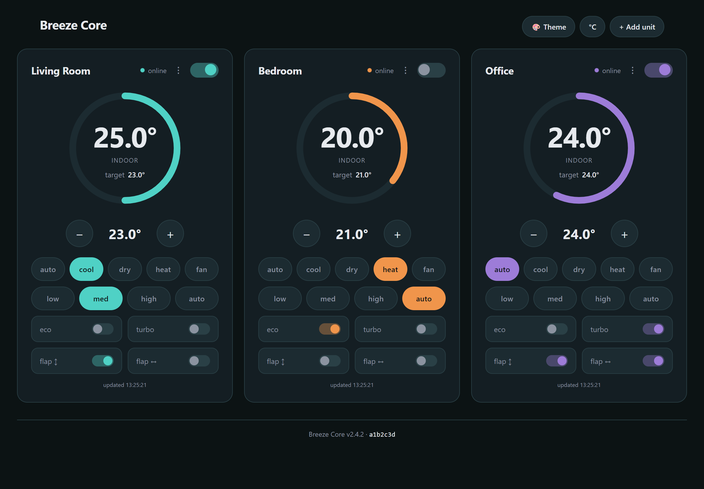
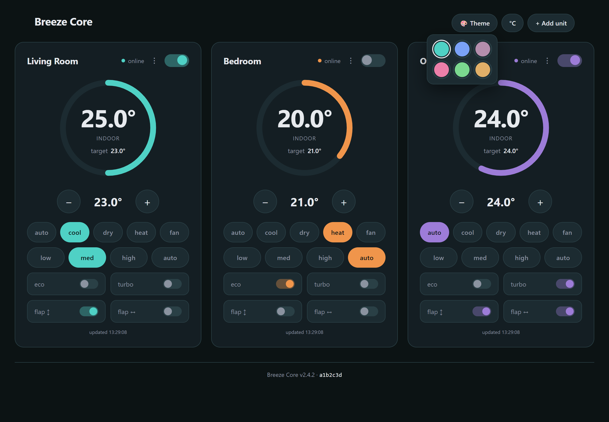

# Breeze Core

Self-hosted control for **Midea air conditioners** — a LAN-first REST API, a web control panel, and a diagnostic CLI, plus an optional native Android app (**Breeze**). After a one-time local pairing there is **no cloud dependency**: your units are controlled directly over your own network.

Built on [msmart-ng](https://github.com/mill1000/midea-msmart) (device I/O), [FastAPI](https://fastapi.tiangolo.com/) + [uvicorn](https://www.uvicorn.org/) (HTTP), vanilla-JS ES modules (web UI), and zsh (diagnostics). Runs on any mainstream Linux distribution — systemd is the smoothest path, but non-systemd inits (OpenRC, runit, s6, supervisord), musl-libc distros (Alpine, Void), the BSDs, macOS, and **Windows** (guided installer + service + Caddy) are supported too (see the install guide).

> **Naming.** The project/product is **Breeze Core**. Under the hood the Python package is `meow_ac`, so the uvicorn entry point you'll see in commands is `meow_ac.app:app`. Everything else (install directory, service name, config directory) is up to you — this guide uses `/opt/breeze-core`, `breeze-core.service`, and `/etc/breeze-core`, all wired via environment variables.

---

## Contents

- [What you get](#what-you-get)
- [Get started](#get-started)
- [Architecture](#architecture)
- [Requirements](#requirements)
- [Detailed guides](#detailed-guides)
- [Configuration](#configuration)
- [Authentication (device pairing)](#authentication-device-pairing)
- [REST API reference](#rest-api-reference)
- [Control / state schema](#control--state-schema)
- [Web UI](#web-ui)
- [Diagnostic & approval tools](#diagnostic--approval-tools)
- [Troubleshooting](#troubleshooting)
- [The Breeze app](#the-breeze-app)
- [Security](#security)
- [Sharing / license](#sharing--license)

---

## What you get

Four decoupled components that share exactly one contract — the `/api/*` endpoints:

| Component | Path | What it is |
|---|---|---|
| **Server** | `meow_ac/` | The FastAPI app — the only stateful part. A standalone REST API (`meow_ac.app:app`). |
| **Web UI** | `static/` | Self-contained vanilla-JS control panel, served by the app. Just an API client. |
| **Diagnostic CLI** | `tools/ac-diag.zsh` | HTTP-only health/latency checker. |
| **Approval CLI** | `tools/ac-approve.zsh` | Admin tool to approve device pairings and manage tokens (LAN-only). |
| **Breeze (Android)** | *separate repo* | Optional native app — mirrors the web UI plus programs, diagnostics, and server switching. See the [**breeze**](https://github.com/monikapurpl3/breeze) repository. |

Delete any client and the API and the others keep working.

---

## Get started

New here? Pick how you want to run it. **Every path ends the same way: open the web page it gives you, type the access key it printed, and you're controlling your AC.** No cloud account, nothing leaves your home network.

**Before you start:** your Midea unit should already be on your Wi-Fi (you do that once with the *NetHome Plus* phone app). Then pick one:

### 🐳 Docker — easiest, any operating system

If you have Docker, this is the least fuss — two commands:

```bash
# 1. find your AC units and pair (this prints an access key once — copy it)
docker run --rm -it --network host -v breeze:/etc/breeze-core \
  ghcr.io/monikapurpl3/breeze-core:latest python setup_device.py

# 2. leave it running
docker run -d --name breeze --restart unless-stopped --network host \
  -v breeze:/etc/breeze-core ghcr.io/monikapurpl3/breeze-core:latest
```

Then open **`http://<this-computer's-IP>:8420`** in a browser. Compose file, updates, and options → [docs/DOCKER.md](docs/DOCKER.md).

### 🪟 Windows — just double-click an installer

Download **`Breeze-Core-Setup.exe`** from the [latest release](https://github.com/monikapurpl3/breeze-core/releases/latest) and run it. It sets Breeze Core up as a background service and offers to find your units for you — no commands to type. Full walkthrough → [docs/WINDOWS.md](docs/WINDOWS.md).

### 🐧 Linux — three short steps

First, a one-time install of Python using your system's line:

| Your system | One-time setup |
|---|---|
| Fedora · RHEL · AlmaLinux · Rocky | `sudo dnf install -y python3 python3-pip git` |
| Debian · Ubuntu · Raspberry Pi OS · Mint | `sudo apt install -y python3 python3-venv python3-pip git` |
| openSUSE · SLES | `sudo zypper install -y python3 python3-pip git` |
| Arch · Manjaro | `sudo pacman -S --needed python git` |
| Alpine | `sudo apk add python3 py3-pip git` |
| NixOS | it's declarative — use the recipe in [the install guide](docs/INSTALL.md#nixos-declarative) |

Then, in a folder of your choice:

```bash
git clone https://github.com/monikapurpl3/breeze-core && cd breeze-core
python3 -m venv venv && ./venv/bin/pip install -r requirements.txt
./venv/bin/python setup_device.py                              # finds units, prints the key once
./venv/bin/uvicorn meow_ac.app:app --host 0.0.0.0 --port 8420  # start it
```

Open **`http://<this-computer's-IP>:8420`**. To have it start automatically on every boot (recommended), the [install guide](docs/INSTALL.md) turns this into a proper always-on service in a few more minutes — with exact steps per distro, including systems without systemd.

### 🍎 macOS

```bash
brew install python git
```

…then the same three commands as Linux above. To keep it running in the background, see [the install guide → macOS](docs/INSTALL.md#macos).

### 😈 FreeBSD / other BSD

```sh
sudo pkg install python311 py311-pip git
```

…then the same three commands, and run it under `rc.d` — see [the install guide → BSD](docs/INSTALL.md#freebsd-and-other-bsds).

> **Want to reach it from outside your home** (over the internet, with HTTPS)? Get it working on your network first, then follow [REVERSE-PROXY.md](docs/REVERSE-PROXY.md) (Linux) or the built-in Caddy wizard on [Windows](docs/WINDOWS.md#5-expose-it-publicly-with-caddy) — and skim [HARDENING.md](HARDENING.md) before you do.

---

## Architecture

```
   Browser / Breeze app ─┐
                         │  HTTPS (via reverse proxy)  or  HTTP on the LAN
   ac-diag.zsh ──────────┤
                         ▼
              ┌─────────────────────────────┐
              │  uvicorn → meow_ac.app:app   │   (systemd service, one worker)
              │   ├── /api/auth/*   pairing  │
              │   ├── /api/units*   control  │
              │   ├── /api/programs favourites/schedules/curves + scheduler
              │   └── /  static web UI       │
              │            │ msmart-ng       │
              │            ▼                 │
              │   AC device objects (cached) │
              └────────────┬────────────────┘
                           │ TCP :6444 per unit
                    Midea AC units on the LAN
```

Inside the package, work is split into small layers assembled by an app factory (`create_app()` in `meow_ac/app.py`): **settings** (env), **config** (`config.json` store), **security** (device-pairing auth), **devices** (connection lifecycle + wire schema), **programs** (favourites/schedules/curves + a background scheduler), and **api** (router factories). Connections are lazy and cached per unit; every read/write is a live LAN round-trip.

---

## Requirements

- A host with network access to your AC units (a small always-on machine: mini-PC, NUC, Raspberry Pi, old laptop, VM…). **systemd** Linux is the smoothest path and the only one with the built-in sandbox; **non-systemd inits** (OpenRC/runit/s6/supervisord), **musl-libc** distros (Alpine, Void), the **BSDs**, **macOS**, and **Windows** (guided installer + hardened service + Caddy — see [docs/WINDOWS.md](docs/WINDOWS.md)) are supported too.
- **Python 3.11+**.
- **Midea AC units** on the same LAN, already provisioned to your WiFi with the *NetHome Plus* app (Breeze Core does not do WiFi provisioning).
- `curl` + `jq` + `zsh` for the diagnostic/approval CLIs (optional).
- **Optional, for remote access:** a reverse proxy (nginx or Apache) and a TLS certificate — see [docs/REVERSE-PROXY.md](docs/REVERSE-PROXY.md).

---

## Detailed guides

- **[docs/INSTALL.md](docs/INSTALL.md)** — step-by-step install as a service, with separate instructions for **RHEL & compatibles**, **Debian & compatibles**, **openSUSE/SLES**, **NixOS/Nix**, and **other** distros, plus first-class paths for **non-systemd inits** (OpenRC, runit, s6, supervisord, SysV), **non-glibc / musl** systems (Alpine, Void-musl), and the **BSDs / macOS** — including the distro-specific extras that help (SELinux, AppArmor, firewalld/ufw/nftables, declarative NixOS).
- **[docs/WINDOWS.md](docs/WINDOWS.md)** — Windows as a first-class target: a guided **NSIS installer**, Breeze Core as a hardened Windows **service** (bundled NSSM, `LOCAL SERVICE`, LAN-locked firewall), an optional guided **Caddy** reverse proxy (automatic HTTPS), and a **fail2ban-style** IP banner. Scripts live in [`deploy/windows/`](deploy/windows/).
- **[docs/REVERSE-PROXY.md](docs/REVERSE-PROXY.md)** — exposing Breeze Core beyond the LAN: **nginx** and **Apache** configs (separately), **TLS certificates** (Let's Encrypt via certbot and via acme.sh), and the app-side settings that make it safe behind a proxy. For automation, [`deploy/reverse-proxy-wizard.sh`](deploy/reverse-proxy-wizard.sh) generates and installs it (with a `--dry-run`); on **Windows** the [Caddy wizard](docs/WINDOWS.md#5-expose-it-publicly-with-caddy) does the equivalent.
- **[docs/DOCKER.md](docs/DOCKER.md)** — run Breeze Core as a container: a compact, non-root image on Red Hat **UBI 9** (multi-arch, published to GHCR), with a Compose example.
- **[HARDENING.md](HARDENING.md)** — the security review + public-exposure runbook and go-live checklist.

---

## Configuration

`config.json` — written and maintained by `setup_device.py`, read and validated by the app. Its location is set by `AC_CONFIG` (this guide uses `/etc/breeze-core/config.json`).

```json
{
  "api_key": "randomly-generated-urlsafe-string",
  "units": [
    { "name": "Living Room", "ip": "192.168.1.73", "port": 6444,
      "id": 153931628470980, "token": null, "key": null }
  ]
}
```

| Field | Notes |
|---|---|
| `api_key` | The **enrollment** secret — needed to *begin* pairing (see [Authentication](#authentication-device-pairing)). Generated by `setup_device.py`. |
| `units[].name/ip/port/id` | Friendly name, LAN IP, control port (usually `6444`), Midea device id. |
| `units[].token/key` | V3 auth credentials (`null` for V1/V2). Back these up — they can't be re-derived if the Midea cloud is unreachable. |

### Runtime settings (environment variables)

Read once at startup. Defaults are safe for public exposure (docs off, headers on, LAN-only approval).

| Var | Default | Purpose |
|---|---|---|
| `AC_CONFIG` | `/etc/meow-ac/config.json` | config file path |
| `AC_DEVICES` | `<config dir>/devices.json` | per-device token store (app-written) |
| `AC_PROGRAMS` | `<config dir>/programs.json` | favourites/schedules/curves (app-written) |
| `AC_SCHED_TICK` | `30` | scheduler evaluation interval (seconds) |
| `AC_DOCS` | off | set `1` to expose `/docs` (dev only) |
| `AC_SECURITY_HEADERS` | on | emit CSP/HSTS/etc. (turn off if your proxy sets them) |
| `AC_TRUSTED_HOSTS` | any | CSV Host allow-list (`TrustedHostMiddleware`) |
| `AC_BEHIND_PROXY` | off | trust `X-Forwarded-For` for the real client IP |
| `AC_ENROLL_LAN_ONLY` | on | pairing approval must come from a private/LAN address |
| `AC_CODE_TTL` | `60` | pairing-code lifetime (seconds) |
| `AC_TOKEN_TTL_DAYS` | `90` | device-token lifetime; `0` = never expires |

> Point them at your chosen config dir, e.g. `AC_CONFIG=/etc/breeze-core/config.json` — `AC_DEVICES`/`AC_PROGRAMS` then default alongside it.

---

## Authentication (device pairing)

Breeze Core uses an **RFC 8628-style device-pairing** flow, so no long-lived shared password rides on every request:

- The **`api_key`** is an *enrollment* secret: on its own it only authorizes *starting* a pairing.
- A client `POST`s `/api/auth/enroll/start` (with the key) and shows a short, single-use **code** (~60 s).
- An **admin on the LAN** approves that code (via `tools/ac-approve.zsh` or `POST /api/auth/enroll/approve`).
- The client polls `/api/auth/enroll/poll` and receives a **per-device token** — 256-bit, stored **hashed**, individually named, revocable, and expiring.
- **Control endpoints require the API key *and* a valid device token.** Approval and device management are admin-only and restricted to the local network.

Rotating the `api_key` doesn't log devices out (tokens are independent); revoke a single lost device with `ac-approve.zsh revoke <token_id>`.

---

## REST API reference

Base URL: `http://<host>:8420` (or your HTTPS proxy URL). All comparisons are constant-time. Responses are compressed with **brotli** (gzip fallback) when the client sends `Accept-Encoding` — disable with `AC_COMPRESSION=0`.

### Pairing — `/api/auth`
```
POST /api/auth/enroll/start     X-API-Key       → {session_id, user_code, expires_in}
POST /api/auth/enroll/poll      X-API-Key       → {status[, device_token, token_id, label, expires_at]}
POST /api/auth/enroll/approve   X-API-Key + LAN → {token_id, label}                    (admin)
GET  /api/auth/devices          X-API-Key + LAN → [{token_id, label, created_at, ...}]  (admin)
DELETE /api/auth/devices/{id}   X-API-Key + LAN → 204                                   (admin)
```

### Meta — `/api` (health is public; version needs the API key)
```
GET   /api/health               → {status:"ok"}                 (public liveness probe)
GET   /api/version   X-API-Key  → {name, version, features[], units}   (feature-detect)
```

### Units — `/api/units` (require API key **+** device token)
```
GET    /api/units               → [{id, name, ip}]
GET    /api/units/state         → {states:[…], errors:[{id,name,ip,detail}]}  (all units,
                                   fanned out concurrently; unreachable units → online:false
                                   in states, or in errors — never 503s the whole batch)
GET    /api/units/{id}/state    → full state (connects + refreshes the unit)
POST   /api/units/{id}/control  → full state (applies only the fields present)
PATCH  /api/units/{id}          → rename a unit (body {name}) → sanitized unit view
POST   /api/units               → add a unit by LAN IP (body {ip, name?}); discovers
                                   it and writes config.json → 201 sanitized unit view
DELETE /api/units/{id}          → remove a unit from config → 204
GET    /api/config              → sanitized config: [{id,name,ip,port,has_v3_credentials}]
                                   (never returns the api_key or V3 token/key secrets)
```
State object:
```json
{ "id":"…","name":"…","ip":"…","online":true,"power_state":true,
  "operational_mode":"COOL","target_temperature":22.0,
  "indoor_temperature":26.3,"outdoor_temperature":31.0,
  "fan_speed":102,"swing_mode":"BOTH","eco":false,"turbo":false }
```
Errors: `401` bad key/token · `404` unknown unit · `422` out-of-range value · `503` unreachable/apply-failed.

### Programs — `/api/programs` (require API key + token; run server-side)
```
GET    /api/programs            → [Program]
POST   /api/programs            → 201 Program
GET/PUT/DELETE /api/programs/{id}
POST   /api/programs/{id}/apply → [UnitState]   (favourite→scene; curve→now; schedule→400)
GET    /api/programs/status     → {running, tick_seconds, runs, errors, last_run}
```
A **program** targets units (`unit_ids`, empty = all) and is one `kind`:
- **favourite** — a saved scene, applied on demand.
- **schedule** — `{days:[0–6, empty=daily], time:"HH:MM", settings}` triggers, fired when the clock crosses the minute.
- **curve** — `{operational_mode, fan_speed, points:[{time,temperature}]}`; the scheduler sets the interpolated setpoint (cyclic over the day, snapped to 0.5°). Times are **server-local**.

---

## Control / state schema

`operational_mode`: `AUTO COOL DRY HEAT FAN_ONLY` · `swing_mode`: `OFF VERTICAL HORIZONTAL BOTH` (two physical flaps; an unsupported one is silently ignored by firmware) · `target_temperature`: 16.0–30.0 in 0.5° steps · `fan_speed`: `20/40/60/80/100` + `102` (auto). `POST /control` always sets `beep = false`.

---

## Web UI

`static/`, served at `/`. Self-contained native ES modules — no build step, no external dependencies. Prompts for the API key on first load (stored in `localStorage`), runs the pairing flow, then shows a live control card per unit. Manage units (add by IP / rename / remove), toggle °C/°F, and pick from a set of **Material You-like colour palettes** (header 🎨, saved per browser). A footer shows the server's version + build commit (from `/api/version`). Strict CSP; all styling is in `css/styles.css`, all logic in `js/` modules.



<sub>Example dashboard with sample rooms — a live card per unit (dial + setpoint, mode, fan, eco/turbo, and the two flaps), and the version/commit footer.</sub>



<sub>Six built-in Material You-like palettes, switchable from the header 🎨. (All data shown is a non-representative example.)</sub>

---

## Diagnostic & approval tools

Both are self-contained zsh scripts that speak only HTTP (they never import the package). They read `config.json` for the key.

```bash
# health/latency/enum checks on every unit
./tools/ac-diag.zsh --base-url http://<host>:8420 --config /etc/breeze-core/config.json --auto

# approve a pairing code / list / revoke (run on the LAN)
./tools/ac-approve.zsh --base-url http://<host>:8420 --config /etc/breeze-core/config.json approve <CODE>
./tools/ac-approve.zsh --base-url http://<host>:8420 --config /etc/breeze-core/config.json list
```

---

## Troubleshooting

First stops: `curl -s http://<host>:8420/api/health` (no auth — should print `{"status":"ok"}`), `curl -H "X-API-Key: <key>" http://<host>:8420/api/version`, the logs (`journalctl -u breeze-core -f`, or the Docker/NSSM logs), and `tools/ac-diag.zsh … --auto`.

<details><summary><b><code>ac-approve</code> / <code>ac-diag</code>: "can't read config.json — run with sudo, or join the group"</b></summary>

The CLIs read `config.json` for the API key. It's mode **640** (group-readable), so the fix is to add your admin user to the service group **once**, then **log out and back in** (group membership only applies to new logins):

```bash
sudo usermod -aG breeze "$USER"   # use your service group; re-login afterward
id                                # confirm the group shows up
```

After that, run the tool **without `sudo`**.

**Don't `sudo acapprove`** (→ `sudo: acapprove: command not found`). If `acapprove` is a shell **alias**, `sudo` starts a fresh shell that has neither your aliases nor your group — so it can't find the command *and* couldn't read the config anyway. If you truly need root, call the script by its real path:

```bash
sudo zsh /opt/breeze-core/tools/ac-approve.zsh \
  --base-url http://127.0.0.1:8420 --config /etc/breeze-core/config.json approve <CODE>
```
Pairing codes are short-lived (~60 s) — if approval says the code is unknown/expired, just start pairing again from the client.
</details>

<details><summary><b>The API returns 500, or a message telling you to run <code>setup_device.py</code></b></summary>

The service is up but not paired yet — `config.json` has no `api_key`/units. Run `setup_device.py` (see [INSTALL.md](docs/INSTALL.md#4-discover-and-pair-your-units)) to discover units and mint the key, then restart the service. The static UI at `/` still loads; only the API needs a config.
</details>

<details><summary><b>Enrollment fails with a 500 / <code>PermissionError</code> writing <code>devices.json</code></b></summary>

The runtime dir must be owned by the service user (it writes `devices.json`/`programs.json` there) — a root-owned dir makes those writes fail:
```bash
sudo chown -R breeze:breeze /etc/breeze-core
sudo chmod 750 /etc/breeze-core && sudo chmod 640 /etc/breeze-core/config.json
```
</details>

<details><summary><b>Every request gets 401</b></summary>

The per-device token is missing or expired (separate from the API key). Re-pair the device — the web UI and app do this automatically on a 401. Tune lifetime with `AC_TOKEN_TTL_DAYS`.
</details>

<details><summary><b>Approving from the LAN still gives 403 ("admin action must come from the LAN")</b></summary>

Approval must originate from a private IP. **Behind a reverse proxy**, every request looks like `127.0.0.1` unless you forward the real client: set `AC_BEHIND_PROXY=1`, run uvicorn with `--proxy-headers --forwarded-allow-ips 127.0.0.1`, and make the proxy **overwrite** `X-Forwarded-For` with the real peer (nginx `$remote_addr`; Caddy does this by default with no `trusted_proxies`). Appending XFF is spoofable — see [HARDENING.md](HARDENING.md).
</details>

<details><summary><b>Can't reach <code>:8420</code></b></summary>

Behind a proxy the app binds **loopback only** by design — use the proxied HTTPS URL, not `:8420`. On the LAN, check the bind address (a LAN IP, not `0.0.0.0`) and that the firewall allows 8420 from your subnet ([INSTALL.md §6](docs/INSTALL.md#6-open-the-firewall-lan-only)).
</details>

<details><summary><b>fail2ban locked me out / Windows won't start / Docker finds no units</b></summary>

- **fail2ban:** add your LAN to `ignoreip`; don't let a client spray 401s (an expired token repeated across many units can trip a jail).
- **Windows:** the service errors until you've paired (run *Pair AC units* first); SmartScreen on the unsigned installer → *More info → Run anyway*. See [docs/WINDOWS.md](docs/WINDOWS.md).
- **Docker:** discovery (UDP broadcast) needs `--network host`; a bind-mounted state dir must be writable by UID 1001 (`chown 1001:0`). See [docs/DOCKER.md](docs/DOCKER.md).
</details>

---

## The Breeze app

Optional native Android client — its own repository, **[breeze](https://github.com/monikapurpl3/breeze)**: the web UI's controls plus an in-app diagnostics screen, a favourites/schedule/temperature-curve editor, server switching, and Material You dynamic theming. Credentials are stored in Android Keystore-backed encrypted storage; it talks to the same API. Build with `flutter build apk --release` (see its README).

---

## Security

Breeze Core is **LAN-first**. Before exposing it to the internet, read **[HARDENING.md](HARDENING.md)** — it covers the threat model, the strongly-recommended VPN alternative, and, if you do go public, the full runbook (TLS, rate limiting, fail2ban, systemd egress lockdown, and a go-live checklist). What the app enforces on its own: two-credential access (key + per-device token), admin actions gated to the LAN, in-app rate limiting, strict security headers, docs disabled by default, and server-side input bounds.

---

## Sharing / license

Breeze Core is **free software licensed under the GNU Affero General Public License v3.0** ([AGPL-3.0](LICENSE)). It has no telemetry and no cloud callbacks after pairing. You may run, study, share, and modify it; if you run a **modified** version as a network service for others, AGPL §13 requires you to offer them your modified source. All dependencies are permissive (MIT / BSD-3 / Apache-2.0), which AGPL-3.0 allows.

The companion Android app, [**breeze**](https://github.com/monikapurpl3/breeze), is AGPL-3.0 as well.
