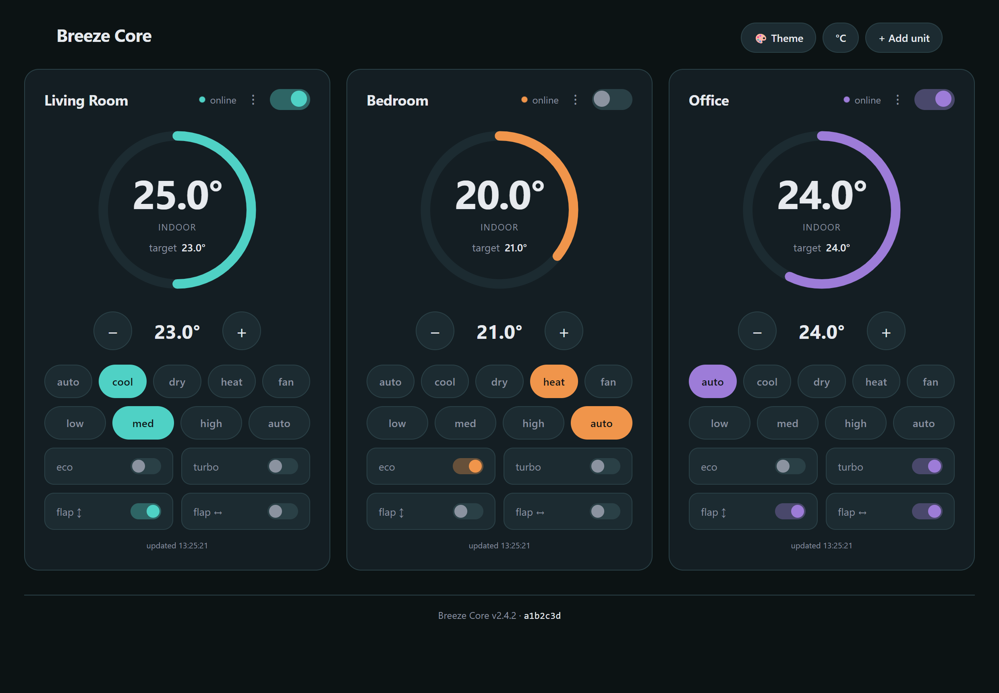
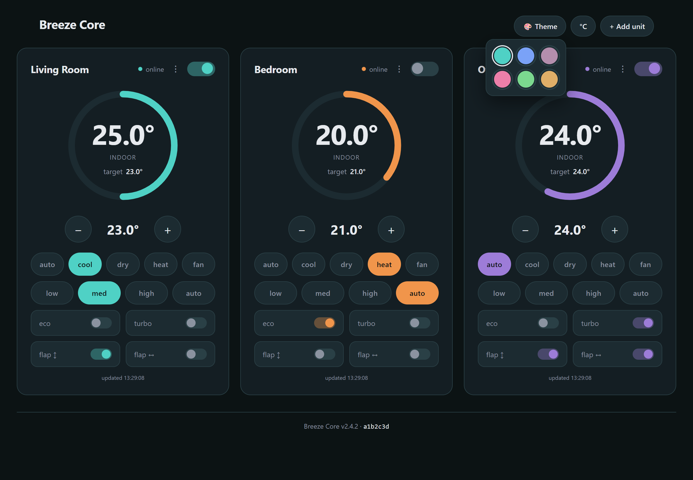

# Breeze Core

Self-hosted control for **Midea air conditioners** — a LAN-first REST API, a
web control panel, and a diagnostic CLI, plus an optional native Android app
(**Breeze**). After a one-time local pairing there is **no cloud dependency**:
your units are controlled directly over your own network.

It's **batteries-included** — panel, app, widgets, Android Auto, server-side
schedules, diagnostics, native packages and a signed repo all ship with it —
and there's [a straight comparison](#compared-to-the-nethome-plus-app) with the
vendor's *NetHome Plus* app below, drawbacks included.



<sub>The web control panel — a live card per unit, six switchable colour
palettes, °C/°F, unit management, and a version footer. (Sample data.)</sub>

---

## What you get

Four decoupled components that share exactly one contract — the `/api/*` endpoints:

| Component | Path | What it is |
|---|---|---|
| **Server** | `meow_ac/` | The FastAPI app — the only stateful part. A standalone REST API. |
| **Web UI** | `static/` | Self-contained vanilla-JS control panel, served by the app. Just an API client. |
| **Diagnostic CLI** | `tools/ac-diag.zsh` | HTTP-only health/latency/security checker. |
| **Approval CLI** | `tools/ac-approve.zsh` | Admin tool to approve device pairings and manage tokens (LAN-only). |
| **Breeze (Android)** | [separate repo](https://github.com/monikapurpl3/breeze) | Optional native app — one-unit-per-screen swipe control with modern sliders/switches, scan-to-add, programs, diagnostics, server switching, home-screen widgets, and an **Android Auto** screen. APK on the [releases page](https://github.com/monikapurpl3/breeze/releases) or the [package host](https://bolero.salataputarica.hr.eu.org/android/). |

Delete any client and the API and the others keep working. Built on
[msmart-ng](https://github.com/mill1000/midea-msmart), [FastAPI](https://fastapi.tiangolo.com/) +
[uvicorn](https://www.uvicorn.org/), and plain ES modules — no build step anywhere.

> **Naming.** The product is **Breeze Core**; the Python package underneath is
> `meow_ac` (so the ASGI entry point is `meow_ac.app:app`). Install paths and
> service names are your choice — the docs use `/etc/breeze-core` etc., wired
> via environment variables.

---

## Batteries included

One install and you're done — there is nothing else to buy, subscribe to, or
bolt on:

| | |
|---|---|
| **Ways to control it** | Web panel in any browser · native **Android app** · **home-screen widgets** (power / temp ± without opening anything) · **Android Auto** · REST API · CLI |
| **Automation, server-side** | Favourites, schedules, and **temperature curves** that run on the server — they fire whether or not your phone is on, charged, or home |
| **Live state** | **SSE push**: changes (yours, a schedule's, another client's) arrive without polling |
| **Operations** | Native packages for **deb · rpm · pacman · apk · OpenWrt · FreeBSD · NetBSD**, a Windows installer, a Docker image, and a **signed repo** so updates come through your package manager |
| **When something's off** | A real diagnostic battery — `breeze-core diag --auto`, mirrored inside the app: auth posture, per-unit latency, capability probing, input validation. `GET /api/system` reports the whole deployment (OS, init, arch, every dependency version, units, enrolled devices) for the app's Nerd screen |
| **Security, from the start** | Two-credential access with **Ed25519 request signing**, LAN-gated admin approval, rate limiting, strict CSP + security headers, and a full go-live runbook in [HARDENING.md](HARDENING.md) |
| **Observability** | Prometheus `/metrics` and a state-history buffer |

No account, no telemetry, no cloud callbacks after pairing, no ads, no build
step, and no "pro" tier — it's [AGPL-3.0](LICENSE) and the source is right here.

---

## Compared to the *NetHome Plus* app

You'll still use the vendor app once, to put the units on Wi-Fi. After that:

| | NetHome Plus | Breeze Core + Breeze |
|---|---|---|
| **Where a command goes** | phone → the internet → Midea's cloud → back down to the AC three metres away | phone → your server → the AC, over your own LAN |
| **Internet down** | nothing works | everything works |
| **What it feels like** | you wait for the cloud round-trip on top of the unit's own response time | the UI moves the instant you touch it (optimistic + SSE), so the unit's own latency is the only real cost |
| **Account** | required, with whatever it logs | none — no sign-up, no e-mail, no ToS |
| **Sharing with the household** | pass the account password around | one credential per device, each **individually revocable**, each approved by an admin on the LAN |
| **Automation** | what the app happens to offer | documented REST API + SSE + Prometheus, plus server-side schedules and temperature curves |
| **Where you can control it from** | the phone app | phone, widget, car, browser, terminal, `curl`, cron |
| **Beeping** | every command chirps | beep is **off** unless you ask for it — change the setpoint at 3 a.m. without waking anyone |
| **Multiple units** | one at a time | swipe between them; one screen each |
| **Updates** | pushed at you; features can vanish | you choose when; a version that works keeps working |
| **The AC's internet access** | needed | you can **firewall the units off the internet entirely** once paired ([HARDENING.md](HARDENING.md)) — no more phoning home |
| **If the vendor sunsets it** | you're stuck | nothing to sunset; it's your machine and your source |

**A word on "faster".** The slow part isn't the network — it's the AC's own
firmware. On the maintainer's units `breeze-core diag` measures roughly
**0.7 s** for a full state query over the LAN, and no client can beat that.
What self-hosting removes is everything *stacked on top* of it: the WAN hop,
the cloud queue, an app cold-start, and outages you can't do anything about.

### The honest drawbacks

- **You need a machine that's always on**, and you're now its sysadmin —
  updates, and a copy of `config.json` + `devices.json` somewhere safe.
- **Pairing isn't fully local.** The units get on Wi-Fi via the vendor app, and
  V3 units need **one internet-connected discovery run**: msmart-ng fetches
  each unit's token/key through the NetHome Plus cloud. Everything after that
  is offline — keep those credentials backed up.
- **Nothing is exposed to the internet by default.** Away-from-home control
  means a **VPN** (recommended) or a reverse proxy you secure yourself.
- **The feature ceiling is your firmware's.** Only what
  [msmart-ng](https://github.com/mill1000/midea-msmart) and your model support:
  some units silently ignore horizontal swing, and there's no filter reset, no
  firmware updates, no energy dashboard.
- **The native app is Android-only.** iOS and desktop get the web panel, which
  is good, but it isn't an app.
- **It's sized for a home** — one worker, one scheduler. Handfuls of units, not
  a building.
- **If the server is down, the app is down.** (Your IR remote never stopped
  working.)
- **No voice assistants out of the box.** No Alexa/Google skill; you'd bridge
  it yourself through the API.
- **Give the units static DHCP leases**, or they'll wander to new addresses.
- **It isn't a home-automation platform.** One brand, one job, no ecosystem —
  if you already run Home Assistant, its Midea integration may fit you better.

---

## Get started

**Before you start:** your Midea units should already be on your Wi-Fi (done
once with the *NetHome Plus* phone app), and you need any small always-on
machine on the same network — mini-PC, Raspberry Pi, NAS, old laptop, VM.

**Every path ends the same way:** open the web page it gives you, enter the
access key it printed, and you're controlling your AC.

### 🐧 Linux — add the package repo *(recommended)*

Self-contained packages (no Python needed) from the **signed repository** at
[bolero.salataputarica.hr.eu.org](https://bolero.salataputarica.hr.eu.org) —
installs *and updates* flow through apt/dnf/pacman/apk/opkg. Debian-family
example (the landing page has the others):

```bash
curl -fsSL https://bolero.salataputarica.hr.eu.org/breeze-core.asc \
  | sudo gpg --dearmor -o /usr/share/keyrings/breeze-core.gpg
echo "deb [signed-by=/usr/share/keyrings/breeze-core.gpg] https://bolero.salataputarica.hr.eu.org/deb stable main" \
  | sudo tee /etc/apt/sources.list.d/breeze-core.list
sudo apt update && sudo apt install breeze-core
```

Then:

```bash
sudo breeze-core pair                        # finds your units, writes the config
sudoedit /etc/breeze-core/breeze-core.env    # set BREEZE_HOST=<this machine's LAN IP>
sudo systemctl enable --now breeze-core      # start it (survives reboots)
```

…and open **`http://<BREEZE_HOST>:8420`**. Full per-distro instructions,
OpenWrt, Void/Gentoo/NixOS, and one-off downloads → **[docs/PACKAGES.md](docs/PACKAGES.md)**.

### 🪟 Windows

Download **`Breeze-Core-Setup.exe`** from the
[latest release](https://github.com/monikapurpl3/breeze-core/releases/latest)
and double-click — it installs the background service and offers to find your
units. Walkthrough → **[docs/WINDOWS.md](docs/WINDOWS.md)**.

### 🐳 Docker · 🍎 macOS · 😈 BSD · 🛡️ OPNsense · 🔧 from source

- **Docker** (if you already run containers): multi-arch image on GHCR → **[docs/DOCKER.md](docs/DOCKER.md)**.
- **macOS / FreeBSD**: from-source install with launchd / rc.d service → **[docs/INSTALL.md](docs/INSTALL.md)**.
- **OPNsense**: the `os-breeze-core` plugin adds a **Services → Breeze Core** page,
  with the whole Python runtime vendored so nothing is ever compiled on the
  firewall → **[docs/OPNSENSE.md](docs/OPNSENSE.md)**.
- **From source on anything** (venv + your own service unit, every distro + non-systemd inits + musl) → **[docs/INSTALL.md](docs/INSTALL.md)**.

> **Reaching it from outside your home** (HTTPS over the internet)? Get it
> working locally first, then follow [docs/REVERSE-PROXY.md](docs/REVERSE-PROXY.md)
> (or the Windows Caddy wizard) — and read [HARDENING.md](HARDENING.md) before you expose anything.

---

## Documentation

| I want to… | Read |
|---|---|
| **Install** from native packages (deb/rpm/pacman/apk/opkg/flake/tarball) | [docs/PACKAGES.md](docs/PACKAGES.md) |
| **Install** from source, on any distro / init / libc, macOS, BSD | [docs/INSTALL.md](docs/INSTALL.md) |
| **Install** on Windows (installer, service, Caddy wizard, tripwire) | [docs/WINDOWS.md](docs/WINDOWS.md) |
| **Install** on **OPNsense** as a plugin (GUI page, service control) | [docs/OPNSENSE.md](docs/OPNSENSE.md) |
| **Run** it as a container (image, compose, variants) | [docs/DOCKER.md](docs/DOCKER.md) |
| **Expose** it to the internet safely (nginx/Apache, TLS, fail2ban) | [docs/REVERSE-PROXY.md](docs/REVERSE-PROXY.md) + [HARDENING.md](HARDENING.md) |
| **Configure** it / call the **REST API** / understand **auth** | [docs/API.md](docs/API.md) |
| **Fix** something (errors, 401/403/500, CLIs, fail2ban) | [docs/TROUBLESHOOTING.md](docs/TROUBLESHOOTING.md) |
| **Package** it for a distro, or build the packages myself | [packaging/README.md](packaging/README.md) |
| Use the **Android app** | the [breeze](https://github.com/monikapurpl3/breeze) repo |

---

## Architecture

```
   Browser / Breeze app ─┐
                         │  HTTPS (via reverse proxy)  or  HTTP on the LAN
   ac-diag.zsh ──────────┤
                         ▼
              ┌─────────────────────────────┐
              │  uvicorn → meow_ac.app:app   │   (one worker + in-process scheduler)
              │   ├── /api/auth/*   pairing  │
              │   ├── /api/units*   control  │
              │   ├── /api/programs favourites/schedules/curves
              │   └── /  static web UI       │
              │            │ msmart-ng       │
              │            ▼                 │
              │   AC device objects (cached) │
              └────────────┬────────────────┘
                           │ TCP :6444 per unit
                    Midea AC units on the LAN
```

Inside the package, small layers are assembled by an app factory
(`create_app()` in `meow_ac/app.py`): **settings** (env) → **config**
(`config.json` store) → **security** (device-pairing auth) → **devices**
(connection lifecycle + wire schema) → **programs** (favourites / schedules /
temperature curves + a background scheduler) → **api** (router factories).
Connections are lazy and cached per unit; every read/write is a live LAN
round-trip. The full wire contract lives in [docs/API.md](docs/API.md).

---

## Web UI

Served by the app at `/`. Self-contained native ES modules — no build step,
no external dependencies. It prompts for the API key on first load (stored in
`localStorage`), runs the pairing flow, then shows a live control card per
unit. Manage units (**add by scanning the network or by IP** / rename /
remove), toggle °C/°F, and pick from six **Material You-like colour palettes**
(header 🎨, saved per browser); the footer shows the server's version + build
commit. Strict CSP — all styling in `css/styles.css`, all logic in `js/`
modules.



<sub>The palette picker. (All data shown is a non-representative example.)</sub>

---

## Security

Breeze Core is **LAN-first**. What the app enforces on its own: two-credential
access (enrollment key **+** a per-device credential — **Ed25519 request
signing** by default, with the secret never on the wire, or a legacy bearer
token — via an
[RFC 8628-style pairing flow](docs/API.md#authentication-device-pairing)),
admin actions gated to the LAN, in-app rate limiting, strict security headers,
interactive docs disabled by default, and server-side input bounds. Before
exposing it to the internet, read **[HARDENING.md](HARDENING.md)** — the
threat model, the strongly-recommended VPN alternative, and the full go-live
runbook (TLS, rate limiting, fail2ban, egress lockdown, checklist).

---

## License

Breeze Core is **free software** under the GNU Affero General Public License
v3.0 ([AGPL-3.0](LICENSE)). No telemetry, no cloud callbacks after pairing.
You may run, study, share, and modify it; if you run a **modified** version as
a network service for others, AGPL §13 requires you to offer them your
modified source. All dependencies are permissive (MIT / BSD-3 / Apache-2.0).
The companion Android app, [breeze](https://github.com/monikapurpl3/breeze),
is AGPL-3.0 as well.
